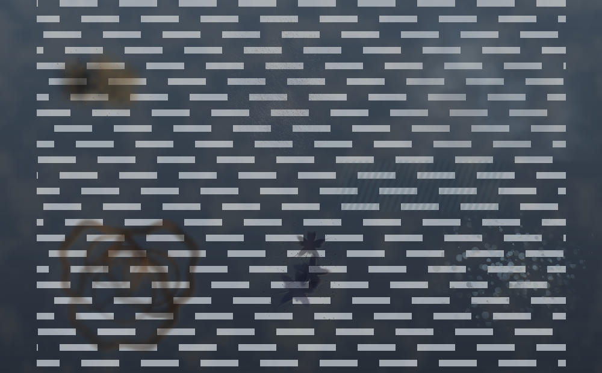

# Smudge

Agent 干活的时候，屏幕开始变脏。拖窗口就是擦。

一个常驻菜单栏的 macOS 覆盖层：Claude Code 每调用一次工具，屏幕上就落下一块脏；
脏会自己慢慢挥发但退不到零，只有任务真正结束才有一道水从上往下把玻璃冲透。
任务挂了或者 token 见底，留下不挥发的红渍。拖任何一个窗口，走过的地方被刮干净，
慢推擦得净、快划只抹开，前缘会堆起油脊、推厚了会崩。



上图是 `--selftest` 的离屏渲染：左上机械油污、中上积灰、右上哈气、
左下咖啡渍、中下墨渍、右下水珠，中间那条横带是刮板走过的地方，
右半边的斜纹是没擦匀留下的水痕。底下垫的是假桌面，用来看可读性。

## 装

去 [Releases](https://github.com/SpaceZephyr/Smudge/releases) 下 DMG，
拖进 Applications。第一次打开被 Gatekeeper 拦的话，右键 → 打开，
或者 `xattr -dr com.apple.quarantine /Applications/Smudge.app`
（只做了 ad-hoc 签名，没买苹果开发者证书）。

## 编译

```bash
./build.sh            # 出 build/Smudge.app
./package.sh 0.1      # 出 build/Smudge-0.1.dmg
open build/Smudge.app
```

要退出：菜单栏那滴油 → 退出 Smudge。

只用 Swift Package Manager，没有 Xcode 工程。着色器是运行时编译的，
所以不需要装 Metal 离线工具链。

想在不动真实屏幕的前提下看渲染效果：

```bash
swift build && ./.build/debug/Smudge --selftest /tmp/out.png
```

六种脏各画几块、中间横擦一道，输出一张 PNG。

另外两个调试口子：

```bash
./.build/release/Smudge --params 某个.json   # 看这个文件会被解析成什么
SMUDGE_DEBUG=1 ./.build/release/Smudge       # 休眠/唤醒打日志
```

## 开销

屏幕干净的时候整个渲染是停的（MTKView 直接 pause，只留一个 10Hz 的计时器
盯着窗口有没有被拖），两块 Retina 屏实测 **1.8% CPU / 149MB**。
Agent 在干活、屏幕上有脏的时候升到 **8–10% CPU / 228MB**（两块屏 60fps）。
合成着色器对完全干净的像素会直接返回，所以脏得少的时候更便宜。

## 权限

**一个都不要。** 不读屏幕内容，所以不需要录屏权限；
窗口位置走 `CGWindowListCopyWindowInfo`，那是公开信息，不需要辅助功能权限。

## 怎么知道 Agent 在干活

两条路，hook 优先。

**Claude Code hooks（准，能分清工具）**
菜单里点「复制 hook 配置」，把复制到的内容合并进 `~/.claude/settings.json`。
之后每次工具调用、每次等你确认、每次任务结束，Claude Code 都会 POST 到
`127.0.0.1:8787`，Smudge 据此决定落哪种脏。

**进程 CPU（糙，但通用）**
没配 hook 的时候，Smudge 每 1.5 秒看一眼名字叫 `claude` 的进程吃了多少 CPU，
超过 12% 就当它在干活。这条路拿不到工具名，所有脏都长一个样，
但换成 Cursor、Codex 或者别的 agent 也能用（改 `agentProcessNames`）。

hook 一旦有动静，90 秒内就不看 CPU 了。

## 六种脏

| 类型 | 对应工具 | 性格 |
|---|---|---|
| 机械油污 | Bash | 厚圆瓣带甩点，有光泽 |
| 积灰 | Read / Glob | 干颗粒，一擦就掉，最容易抹花 |
| 哈气 | Grep / WebSearch | 全是软边，挥发是油的三倍多 |
| 墨渍 | Write / Edit | 实心核心甩细触须，赖着不走 |
| 咖啡渍 | Task | 环形，最难擦，挥发最慢 |
| 水珠 | — | 一颗颗硬边水滴，自带亮边 |

菜单里关掉「按工具映射污渍」就全用一种（`params.json` 里的 `type`）。

## 参数

刮板实验场（网页版）调好手感之后导出 JSON，菜单里「载入参数 JSON…」直接吃进来，
存在 `~/.config/smudge/params.json`。

两个 macOS 版独有的开关不在实验场里：

- `claudeWindowOnly` — 只有 Claude Code 所在的那个终端窗口能当刮板。
  默认关，也就是拖任何窗口都能擦。开了之后靠 hook 报上来的进程号往上找
  它所在的终端窗口。
- `agentProcessNames` — CPU 兜底认哪些进程名。

## 已知的坑

**盖不住真正全屏的应用。** 进了独立 Space 的全屏窗口在覆盖层之上，
这是 macOS 的窗口层级限制，绕不过去。

**颜色和网页版实验场不完全一样。** 实验场用了 multiply 和 screen 混合模式，
覆盖窗口只能 source-over，没法和底下的桌面做乘法。所以这里改成了物理上更对的
模型：每种脏有一个吸光色和一个散射色，噪声决定局部是压暗还是提亮。
油和墨还是压暗为主，灰、雾、水珠靠提亮，因为它们本来就是散射光的。

**ad-hoc 签名。** `build.sh` 用 `codesign --sign -`，换机器要重新编。

## 结构

```
Config.swift        六种脏的性格、参数表、工具映射
Shaders.swift       全部 MSL，运行时编译
DirtSim.swift       GPU 上的遮罩：生成 / 挥发 / 擦除全靠固定功能混合，不回读
Overlay.swift       每块屏幕一个透明窗口 + 一份遮罩
Engine.swift        状态机、生成节奏、擦除、油脊、冲洗
WindowTracker.swift 轮询窗口位置，动了就是在擦
AgentMonitor.swift  hook 的 HTTP 服务 + CPU 兜底
Sound.swift         实时合成，没有音频文件
SelfTest.swift      离屏出图
```

脏污全程待在 GPU 纹理里。生成是 `dst + src(1-dst)`，挥发是 `dst * k`，
擦是 `dst * (1-e)` —— 三种固定功能混合，没有一次回读，所以四块屏幕也不心疼。
